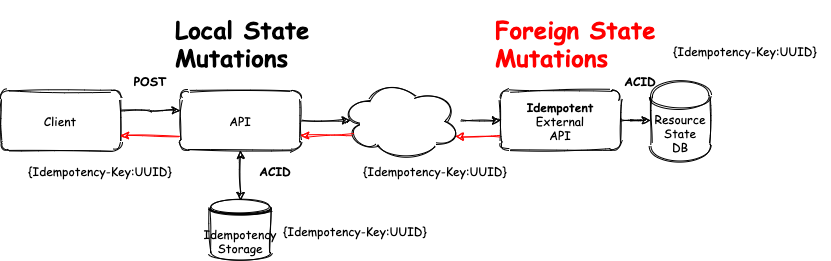

# Idempotent API

Handling with [Idempotency-Key](#) on RDBMS

---

## Idempotency 

```java
Mathematics: f(f(x)) == f(x)

Programming: "example".toUpperCase();

Http: GET method
```

Note: El **estado no cambia**.

**Side effects** ocurren solo una vez. 

**Beneficios:** reintentos seguros, trata duplicados, ayuda integridad data 

---

## Scenarios

1. Local State Mutations
2. Foreign State Mutations

---

## Local State Mutations


Note: 

1. Busco Idempotency-Key en Storage
2. Si esta devuelvo Response
3. Si no, actualizo estado y Storage con Response

---

## Foreign State Mutations



Note: Hacer cambios locales **sin perder de vista cambios remotos**

---

## Account Creation Process


---

## Account [Idempotent](#) API


---

## Request Timeline


Note:

**Acciones para cada Request**

---

## Architectural Enablers

1. Idempotency-Key
2. Atomic Phases (RDBMS & ACID)
3. Recovery Points
4. Directed Acyclic Graph (DAG)

---

## Idempotency Key

```sql
CREATE TABLE idempotency_keys (
    id              BIGSERIAL   PRIMARY KEY,
    idempotency_key TEXT        NOT NULL,
    
    -- parameters of the incoming request
    request_method  TEXT        NOT NULL,
    request_params  TEXT        NOT NULL,
    request_path    TEXT        NOT NULL,

    -- for finished requests, stored status code and body
    response_code   INT         NULL,
    response_body   TEXT        NULL,

    recovery_point  TEXT        NOT NULL
);
```

---

## Recovery Points
```java
public enum RecoveryPoint {
	RECOVERY_POINT_STARTED("started"), 
	RECOVERY_POINT_ACCOUNT_CREATED("account_created"),
	RECOVERY_POINT_DEPOSIT_CREATED("deposit_created"),
	RECOVERY_POINT_FINISHED("finished");
	...
}
```

---

## Atomic Phases 
```java
@Transactional(propagation = Propagation.REQUIRED, 
               isolation = Isolation.SERIALIZABLE) 
public void mutate(String key, Supplier<Action> function) {
    ...
    try  {
        // executes a state mutation
        Action action = function.get();
        
        // updates request life cycle state 
        // with a new recovery point, response, etc.
        action.execute(key);
    } catch (Exception e) {
        // handle exception
        ...
    }
}
```
---

## Directed Acyclic Graph (DAG)


---

## Directed Acyclic Graph (DAG)

```java
...
while (walk) {
	IdempotencyKeys idempotencyKey = idempotencyKeyService.findByKey(key);

	switch (idempotencyKey.getRecoveryPoint()) {
	case RECOVERY_POINT_STARTED:
		//here we perform a new mutation and set new state
		stateMutationService.mutate(key, tx2); 
		break;

	case RECOVERY_POINT_ACCOUNT_CREATED:
		//here we perform a new mutation and set new state
		stateMutationService.mutate(key, tx3); 
		break;

	case RECOVERY_POINT_DEPOSIT_CREATED:
		//here we perform a new mutation and set new state
		stateMutationService.mutate(key, tx4);
		break;

	case RECOVERY_POINT_FINISHED:
		walk = false;
		break;

	default:
		throw new IllegalStateException(
				String.format("Bug! Unhandled recovery point %s'", idempotencyKey.getRecoveryPoint()));
	}
}
```

---

# DEMO

---

## Scenario 1
Successfully Request


Note:

---

## Scenario 2
Network Issue on [Client - Account API](#) 


Note:

---

## Scenario 3
Network Issue on [Account API - Mambu Fake API](#) 


Note:

---

## Scenario 4
Network Issue on [Account API - Cbu Fake API](#) 


Note:

---
## Draining Jobs

 
Note:

---

## Learned Lessons

* Distributed transactions are hard
* Client and Services must do their homework!
* We like ACID ♡
 
Note:

**Client** tiene q implementar retry, timeout y compensaciones

**Service** tiene q ofrecer compensaciones e implementar idempotencia

SAGA vs Idempotencia

Redis vs RDBMS

---

## Much More

* [Implementing Stripe-like Idempotency](https://brandur.org/idempotency-keys)
* [Avoiding Double Payments in a Distributed Payments System](https://medium.com/airbnb-engineering/avoiding-double-payments-in-a-distributed-payments-system-2981f6b070bb)
* [Asynchronous background jobs with Job Drain Pattern](https://brandur.org/job-drain)


---

<!-- .slide: style="text-align: left;" -->
# The End 

* [Handling Idempotency on Java with Idempotency-Key](https://gitlab.naranja.dev/nx/arquitectura/idempotency)