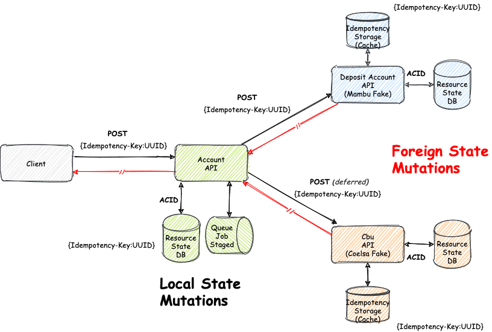
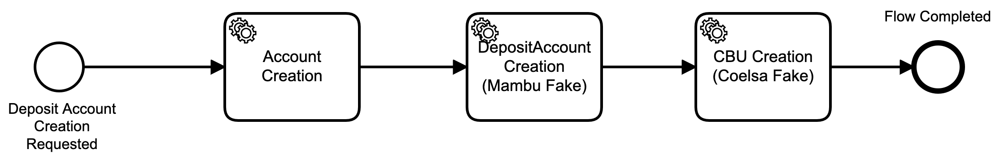

# Handling Idempotency on Account API

Ejemplo de manejo de idempotencia sobre una API que mantiene estado propio (***local state***), y a su vez consume otras APIs que mantienen su estado propio e independiente (***foreign state***)

## In a nutshell

 

## Idempotent API

API **idempotente** encargada de la creacion de cuentas. Esta se integra con [Fake API](#fake-api) para poder soportar el [proceso de creacion de cuenta](#account-creation-process)

|                    Endpoint                   | Method |        Description           | Idempotent |
|:---------------------------------------------:|:------:|:----------------------------:|:----------:|
| [/account](http://localhost:8080/account)     |  POST  |     Creates a new account    |    true

## Fake API

Una implementacion *fake* basada en [Mambu Deposit Accounts API](https://api.mambu.com/#deposit-accounts-create) y [Coelsa CbuOnline API](https://drive.google.com/drive/u/0/folders/1AKp2BHwrOV669p6r4Ie1eBi04y7fislD)

Mantiene un estado separado e independiente de [Idempotent API](#idempotent-api) y expone los siguientes endpoints:

|                    Endpoint                   | Method |        Description            | Idempotent |
|:---------------------------------------------:|:------:|:-----------------------------:|:----------:|
| [/deposits](http://localhost:8081/deposits)   |  POST  | Creates a new deposit account |    true
| [/cbuOnline](http://localhost:8081/cbuOnline) |  POST  | Creates a new cbu             |    true 

## Account Creation Process
Un simple proceso que consiste de los siguientes *steps*:

1. Creacion de Cuenta (implica ***local state mutation***)
2. Creacion de Cuenta de Depositos en core bancario (implica ***foreign state mutation***)
3. Creacion de CBU asociado a la cuenta (implica ***foregin state mutation***)

## References

* [Idempotent API in-depth](idempotent-api/README.md)
* [Fake API in-depth](fake-api/README.md)