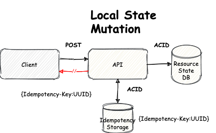

# Fake API

Implementacion fake de las APIs de Mambu y Coelsa en el dominio de cuentas.

## /deposits Endpoint (Fake Mambu Deposit Accounts create)

Todo lo relacionado con la creacion de recursos [DepositAccount](../fake-api/src/main/java/com/demo/idempotency/fake/api/deposit/model/DepositAccount.java) se encuentra bajo el package `com.demo.idempotency.fake.api.deposit`


## /cbuOnline Endpoint (Fake Coelsa CbuOnline create) 

Todo lo relacionado con la creacion de recursos [Cbu](../fake-api/src/main/java/com/demo/idempotency/fake/api/cbu/model/Cbu.java) se encuentra bajo el package `com.demo.idempotency.fake.api.cbu`


## Idempotency

Dado que sobre esta API solo vamos a tener mutaciones de estado local, el manejo de idempotencia lo realizamos relacionando ***HTTP requests*** con ***DB transactions*** (Ver [Idempotency Key](#idempotency-key) e [Idempotency Storage](#idempotency-storage))

 

Ejemplo: 

```java
@PostMapping("/cbuOnline")
public ResponseEntity<CbuDto> createCbu(@Valid @RequestBody CbuDto cbuDto,
        @RequestHeader("Idempotency-Key") String key) {

    // here we implement the logic associated with the creation of a resource

    // if the key is present, we return the cached results and do not execute anything
    // if the key is not present in our idempotency storage (Redis, Caffeine, etc.), we perform action and cache the output at our idempotency storage

    return responseEntity;
}
```
### Idempotency Storage

Tanto los request que estan siendo procesados o los que ya fueron procesados se encuentran almacenados una cache (Caffeine):


| Endpoint    |         Cache              |                        Description                           |     Key              |
|:-----------:|:--------------------------:|:------------------------------------------------------------:|:--------------------:|
| /deposits   |  deposit_idempotency_cache | Data de requests sobre /deposits ya procesados o en proceso  | ${Idempotency-Key}
| /cbuOnline  |  cbu_idempotency_cache     | Data de requests sobre /cbuOnline ya procesados o en proceso | ${Idempotency-Key} 

### Idempotency Key
Identificador unico que deben enviar los clientes cada vez que soliciten la creacion de un recurso, o cuando realicen un pedido de reintento. Se espera que este valor sea enviado como un HTTP request header

```
curl --location --request POST 'http://localhost:8080/account' \
--header 'Idempotency-Key: 8b6882a8-2511-4a6a-8a33-f7d97aa17fa4' \
--data-raw '{
    "accountHolderId" : "123123123123123",
    "productTypeId" : "CAS",
    "ownerName": "Juan Olivera",
    "ownerCuit": "20-28637207-5",
    "ownerType": "F",
    "accountType": "10",
    "currency": "032",
    "cbu": "2850590940090418135201"
}'
```
## State
El estado de los recursos se mantiene sobre una [RDBMS](http://localhost:8081/h2-console) desplegada en memoria (H2)

```yaml
datasource:
url: jdbc:h2:mem:testdb
driverClassName: org.h2.Driver
username: admin
password: admin
jpa:
database-platform: org.hibernate.dialect.H2Dialect
h2:
console.enabled: true
```
