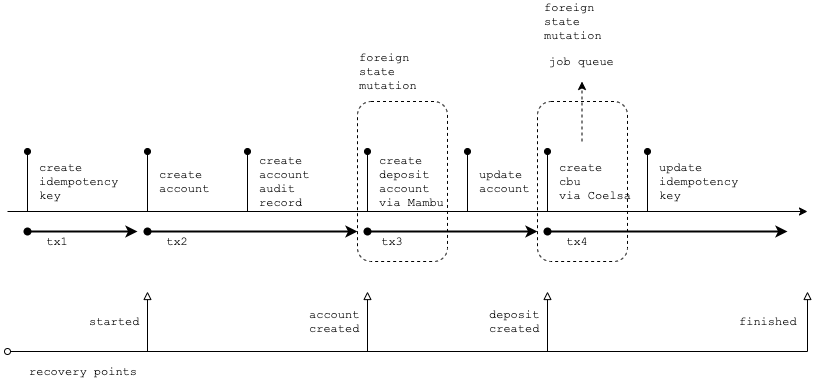
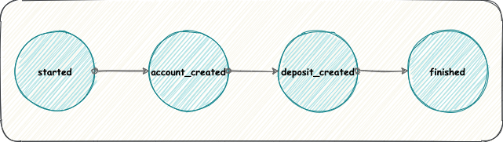

# Account API
El proceso de creacion de cuenta pensado para este ejemplo esta implementado a traves de 3 APIs independientes que se comunican entre si:

1. **Account API:** Mantiene su propio estado y se comunica tanto con Deposit Account API como con Cbu API
2. **Deposit Account API**: Mantiene su propio estado y permite la creacion de cuentas para un usuario
3. **Cbu API**: Mantiene su propio estado y permite la creacion de cbu's para ser asociados a la cuentas de usuario. Esta API contiene tareas que consumen mucho tiempo y recursos

## Local vs Foreign state mutations
Los cambios de estado local (***Local State Mutations***), pueden confirmarse de manera segura gracias a las propiedades ACID brindadas por el RDBMS. Con esto, podemos garantizar que todos los cambios sobre Account API seran confirmados (*commit*) o todos seran descartados (*rollback*).

Por otro lado, los cambios de estado remoto (***Foreign State Mutations***) se encuentran fuera del RDBMS en el que se confirman los cambios locales, por lo tanto necesitamos un mecanismo que permita sincronizar tanto las confirmaciones de cambios locales como las confirmaciones de cambios remotos.


## Handling Idempotency on Account API
El manejo de idempotencia sobre AccountAPI se realiza utilizando [Idempotency-Key](#idempotency-key) y un [RDBMS](#rdbms--acid) que no solo mantiene el estado (*local*) de los recursos, sino que ademas trackea el ciclo de vida completo de cada *request* que se realizo sobre la API (ver [Tracking request lifecycle](#tracking-request-lifecycle)). De esta manera, no perdemos de vista los cambios de estado que se suceden fuera de los limites (*foreign*) de nuestra API.

### Idempotency Key
Una clave unica (*aka Idempotency-Key*) que le permite distinguir pedidos ya procesados de aquellos que son nuevos, con el fin de asegurar que los reintentos por parte de los clientes sean seguros.

Ejemplo:
`Idempotency-Key: 8b6882a8-2511-4a6a-8a33-f7d97aa17fa4`

### Request lifecycle
El ciclo de vida de cada *request* sobre Account API puede representarse de la siguiente manera:



## Implementing Idempotency

### Atomic Phases
Una fase atomica agrupa un conjunto de cambios que necesitan ser confirmados (o descartados) como un todo. El conjunto de cambios puede representarse por medio de una `@FunctionalInterface`

```java
Supplier<Action> tx2 = new Supplier<Action>() {
	
	@Override
	public Action get() {
		// create account (local state mutation)
		Accounts account = accountService
				.save(new Accounts().toBuilder().accountHolderId(accountDto.getAccountHolderId())
						.productTypeId(ProductType.valueOf(accountDto.getProductTypeId()))
						.idempotencyKeyId(idempotencyKey.getId())
						.build());
		
		// create account audit record (local state mutation)
		auditService.save(new AuditRecords().toBuilder().event(AuditEvent.ACCOUNT_CREATED)
				.data(getInputParameters(accountDto)).originIp(request.getLocalAddr())
				.resourceId(account.getId()).resourceType(RESOURCE_TYPE_ACCOUNT)
				.build());

		// Creating new recovery point
		return new RecoveryPointActionImpl(RecoveryPoint.RECOVERY_POINT_ACCOUNT_CREATED.getName());
	}
};
```

Este conjunto de cambios puede ejecutarse como un todo a traves de un servicio transaccional:

```java
public class AtomicStateMutationServiceImpl implements StateMutationService {

	@Transactional(propagation = Propagation.REQUIRED, isolation = Isolation.SERIALIZABLE)
	@Override
	public void mutate(String key, Supplier<Action> function) {
		boolean error = false;
		try  {
			// executing a set of state mutations
			Action action = function.get();
			
			// updating request life cycle state
			action.execute(key);
		} catch (Exception e) {
			// handling exception
		}
        ...
	}
}
```

### Directed Acyclic Graph (DAG)
Podemos representar el ciclo de vida de un request por medio de un [DAG](https://en.wikipedia.org/wiki/Directed_acyclic_graph) en el cual los **vertices** representan los estados alcanzados ([Recovery Point](#recovery-points)) en el ciclo de vida y las **aristas** representan el trabajo realizado (state mutations) que nos permite alcanzar un nuevo estado. 



A medida que avanzamos en el grafo, vamos marcando un nuevo estado, asi hasta alcanzar un estado final. 

```java
...
while (walk) {
	IdempotencyKeys idempotencyKey = idempotencyKeyService.findByKey(key);

	switch (idempotencyKey.getRecoveryPoint()) {
	case RECOVERY_POINT_STARTED:
		stateMutationService.mutate(key, tx2); //here we perform a new mutation and set new state
		break;

	case RECOVERY_POINT_ACCOUNT_CREATED:
		stateMutationService.mutate(key, tx3); //here we perform a new mutation and set new state
		break;

	case RECOVERY_POINT_DEPOSIT_CREATED:
		stateMutationService.mutate(key, tx4); //here we perform a new mutation and set new state
		break;

	case RECOVERY_POINT_FINISHED:
		walk = false;
		break;

	default:
		throw new IllegalStateException(
				String.format("Bug! Unhandled recovery point %s'", idempotencyKey.getRecoveryPoint()));
	}
}
```

### Recovery Points
Un [RecoveryPoint](src/main/java/com/demo/idempotency/api/enumeration/RecoveryPoint.java) es una marca que nos indican en que estado se encuentra un request particular (started, account_created, finished, etc.).

### Actions
Un [Action](src/main/java/com/demo/idempotency/api/action/Action.java) representa una accion a realizar una vez realizado un cambio de estado. Estas pueden ser setear un nuevo [Recovery Point](#recovery-points), setear una nueva respuesta (esto implica dentro del [DAG](#directed-acyclic-graph-dag) movernos a un estado final), etc.

### Tracking request lifecycle
```sql
CREATE TABLE idempotency_keys (
    id              BIGSERIAL   PRIMARY KEY,
    created_at      TIMESTAMPTZ NOT NULL DEFAULT now(),
    idempotency_key TEXT        NOT NULL
        CHECK (char_length(idempotency_key) <= 100),
    last_run_at     TIMESTAMPTZ NOT NULL DEFAULT NOW(),
    locked_at       TIMESTAMPTZ DEFAULT now(),

    -- parameters of the incoming request
    request_method  TEXT        NOT NULL
        CHECK (char_length(request_method) <= 10),
    request_params  TEXT       NOT NULL,
    request_path    TEXT        NOT NULL
        CHECK (char_length(request_path) <= 100),

    -- for finished requests, stored status code and body
    response_code   INT         NULL,
    response_body   TEXT       NULL,

    recovery_point  TEXT        NOT NULL
        CHECK (char_length(recovery_point) <= 50),
    user_id         BIGINT      NOT NULL
);
```

### Local state mutation
Un conjunto de cambios atomicos que modificacion el estado sobre un RDBMS local

```java
...
case RECOVERY_POINT_STARTED:
    log.info("DAG step {}", RecoveryPoint.RECOVERY_POINT_STARTED);
    stateMutationService.mutate(key, () -> {
        // local state mutations
        log.info("tx2 -> create account");
        Accounts account = accountService
                .save(new Accounts().toBuilder().accountHolderId(accountDto.getAccountHolderId())
                        .productTypeId(ProductType.valueOf(accountDto.getProductTypeId()))
                        .idempotencyKeyId(idempotencyKey.getId())
                        .build());
        
        log.info("tx2 -> create account audit record");
        auditService.save(new AuditRecords().toBuilder().event(AuditEvent.ACCOUNT_CREATED)
                .data(getInputParameters(accountDto)).originIp(request.getLocalAddr())
                .resourceId(account.getId()).resourceType(RESOURCE_TYPE_ACCOUNT)
                .build());

        // Creating new recovery point
        return new RecoveryPointActionImpl(RecoveryPoint.RECOVERY_POINT_ACCOUNT_CREATED.getName());
    });
    break;
```

### Foreign state mutation on Fake API Mambu
Este conjunto de cambios atomicos modifican el estado gestionado por una API o servicio que esta fuera de los limites de Account API

```java
...
case RECOVERY_POINT_ACCOUNT_CREATED:
    log.info("DAG step {}", RecoveryPoint.RECOVERY_POINT_ACCOUNT_CREATED);
    stateMutationService.mutate(key, () -> {
        Accounts account = accountService.findByIdempotencyKeyId(idempotencyKey.getId());
        try {
            // foreign state mutations
            log.info("tx3 -> create deposit account");
            DepositAccountDto depositAccountDto = this.webClient.post().uri("/deposits")
                    .header("Idempotency-Key", "api-".concat(key))
                    .body(BodyInserters.fromValue(
                            DepositAccountDto.builder()
                                    .accountHolderKey(accountDto.getAccountHolderId())
                                    .productTypeKey(accountDto.getProductTypeId())
                                    .accountHolderType("CLIENT") // dummy value
                                    .name("myDepositAccount") // dummy value
                                    .build()))

                    .retrieve()
                    .onStatus(HttpStatus::is4xxClientError, response -> {
                        log.warn("DepositAccount not updated due a client error");
                        return Mono.error(new ResponseStatusException(HttpStatus.BAD_REQUEST,
                                "4xx error on /deposits external endpoint"));
                    })
                    .onStatus(HttpStatus::is5xxServerError, response -> {
                        log.warn("DepositAccount not updated due a server error");
                        return Mono.error(new ResponseStatusException(HttpStatus.INTERNAL_SERVER_ERROR,
                                "5xx error on /deposits external endpoint"));
                    })
                    .bodyToMono(DepositAccountDto.class)
                    .block();
            
            // local state mutations
            log.info("tx3 -> update account");
            account.setDepositAccountId(depositAccountDto.getId());
            accountService.save(account);
            log.debug("Account updated in DB");

            // Creating new recovery point
            return new RecoveryPointActionImpl(RecoveryPoint.RECOVERY_POINT_DEPOSIT_CREATED.getName());

        } catch (ResponseStatusException e) {
            // Mark this request as error and returning the response
            log.error(e.getReason(), e.getCause());
            return new ResponseActionImpl(e.getStatus(), e.getReason());
        }
    });
    break;
```

### Foreign state mutation on Fake API Coelsa (deferred)
Este conjunto de cambios atomicos modifican el estado gestionado por una API remota pero no como parte del ciclo de request/response sino que lo haran de manera diferida (Ver [Asynchronous Background Job Service](#asynchronous-background-job-service))

```java
...
case RECOVERY_POINT_DEPOSIT_CREATED:
    log.info("DAG step {}", RecoveryPoint.RECOVERY_POINT_DEPOSIT_CREATED);
    stateMutationService.mutate(key, () -> {
        // foreign state mutations (deferred)
        log.info("tx4 -> create cbu job (to run deferred)");
        
        // building args for call to external service
        Map<String, Object> args = new HashMap<>();
        args.put("idempotencyKey", key);
        args.put("ownerName", accountDto.getOwnerName());
        args.put("ownerCuit", accountDto.getOwnerCuit());
        args.put("ownerType", accountDto.getOwnerType());
        args.put("accountType", accountDto.getAccountType());
        args.put("currency", accountDto.getCurrency());
        args.put("cbu", accountDto.getCbu());

        // creating new job in order to run in background 
        StagedJobs stagedJob = StagedJobs.builder().jobName(CREATE_CBU_JOB_NAME).jobArgs(args).build();
        stagedJobService.save(stagedJob);
        log.debug("StagedJob created in DB");

        // Mark this request as success and returning the response
        return new ResponseActionImpl(HttpStatus.CREATED, "Account created successfully");
    });
    break;
```

### Asynchronous Background Job Service
Este servicio se encarga de mover los jobs confirmados por una transaccion a una cola sobre la cual seran procesados (ver [Job Drain Pattern](https://brandur.org/job-drain))

[JobEnqueuerServiceImpl.java](src/main/java/com/demo/idempotency/api/service/job/JobEnqueuerServiceImpl.java)
```java
@Scheduled(fixedRate = 10000)
@Transactional(isolation = Isolation.REPEATABLE_READ)
@Override
public int enque() {
    List<StagedJobs> jobs = stagedJobService.findFirst10(CREATE_CBU_JOB_NAME);
    int sizeJobs = jobs.size();

    for (StagedJobs stagedJobs : jobs) {
        StagedJobsDto dto = StagedJobsDto.builder().jobArgs(stagedJobs.getJobArgs()).build();
        rabbitTemplate.convertAndSend(BACKGROUND_JOBS_QUEUE, dto);
    }
    
    if(sizeJobs > 0) {
        stagedJobService.delete(jobs);
        log.info("Removing enqueued jobs from DB (StagedJobs)");
    } 
    return sizeJobs;
}
```
El nivel de isolacion ***REPEATABLE_READ*** nos asegura que solo los jobs confirmados (*commited*) seran movidos y por lo tanto su ejecucion se hara solo y unicamente si la transaccion de la cual forman parte fue confirmada.

[JobDequeuerServiceImpl.java](src/main/java/com/demo/idempotency/api/service/job/JobDequeuerServiceImpl.java)
```java
@RabbitListener(queues = BACKGROUND_JOBS_QUEUE)
@Retryable(value = { ResponseStatusException.class }, maxAttempts = 3, backoff = @Backoff(delay = 5000))
public void dequeue(StagedJobsDto stagedJobsDto) {
    // performing foreign state mutation
    log.info("tx4 -> create cbu");
    this.webClient.post().uri("/cbuOnline")
            .header("Idempotency-Key", "api-".concat((String) stagedJobsDto.getJobArgs().get("idempotencyKey")))
            .body(BodyInserters.fromValue(stagedJobsDto))

            .retrieve().onStatus(HttpStatus::is4xxClientError, response -> {
                return Mono.error(new ResponseStatusException(HttpStatus.BAD_REQUEST,
                        "4xx error on /cbuOnline external endpoint"));
            }).onStatus(HttpStatus::is5xxServerError, response -> {
                return Mono.error(new ResponseStatusException(HttpStatus.INTERNAL_SERVER_ERROR,
                        "5xx error on /cbuOnline external endpoint. Here could you retry the request ;)"));
            }).bodyToMono(CbuDto.class)
            .block(); 
}
```

## RDBMS
Los cambios de estado sobre recursos locales ([Account](src/main/java/com/demo/idempotency/api/model/Accounts.java), [StagedJobs](src/main/java/com/demo/idempotency/api/model/StagedJobs.java), etc.) asi como el [tracking de los request](#tracking-request-lifecycle) se persisten en un Postgres DB

### Config Datasource:
```yml
  datasource:
    hikari.connectionTimeout: 15000
    hikari.maximumPoolSize: 5
    platform: postgresql     
    initialization-mode: always   
    url: jdbc:postgresql://localhost:5432/account_db
    username: postgres
    password: changeme
  jpa:
    generate-ddl: false
    hibernate.ddl-auto: none
```

**NOTA:** El [DDL](src/main/resources/schema-postgresql.sql) utilizado sobre esta db no se genera a partir del modelo descripto en `com.demo.idempotency.api.model` (ver [config](#config-datasource))

## Other processes
* Completer: TODO
* Reaper: TODO

## Dependencies
* [Postgres DB](https://github.com/khezen/compose-postgres)
* [Rabbit MQ](https://hub.docker.com/_/rabbitmq)

## Reference Documentation
* [Implementing Stripe-like Idempotency Keys in Postgres](https://brandur.org/idempotency-keys#idempotency-key)
* [Avoiding Double Payments in a Distributed Payments System](https://medium.com/airbnb-engineering/avoiding-double-payments-in-a-distributed-payments-system-2981f6b070bb)
* [Job drain](https://brandur.org/job-drain)
